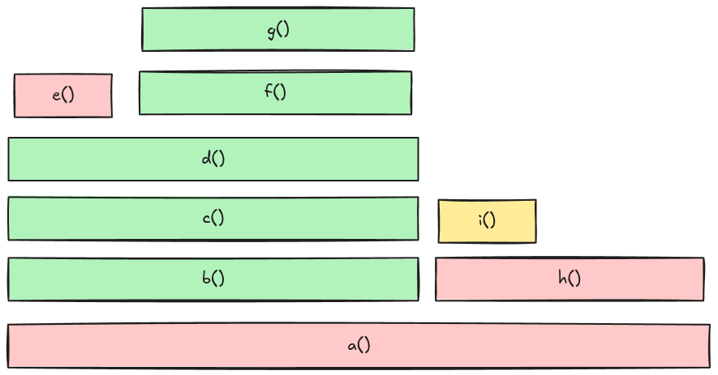
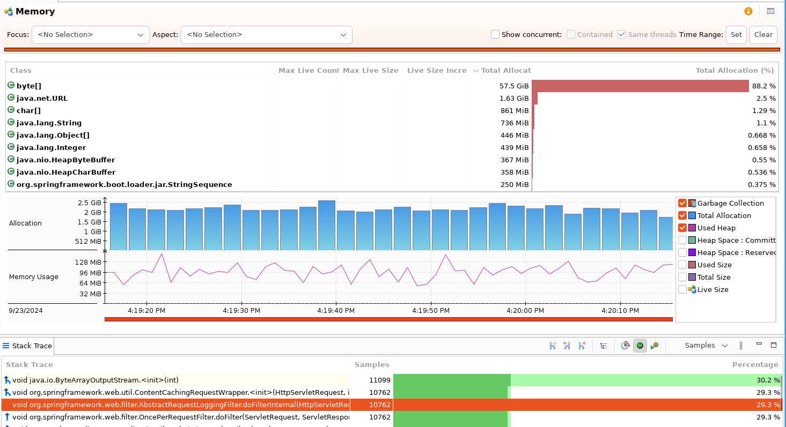

# Workshop Async Profiler

Welcome to this workshop to discover the power of [async-profiler](https://github.com/async-profiler/async-profiler)

## Requirements

WARNING:
async-profiler only works for macos or linux

Here's all the tools you need to have installed of your computer in order to run this workshop:

 - [async-profiler](https://github.com/async-profiler/async-profiler/releases/)
 - [Java 17+](https://adoptium.net/fr/)
 - [Docker Compose](https://docs.docker.com/compose/)
 - [k6](https://k6.io/) (or [Docker](https://docs.docker.com/get-started/get-docker/))


## Getting started

### Start the application

You are going to run a java application. This application has some dependencies that we will discover later.

In a terminal, please run this command to start the needed dependencies:

```sh
docker compose up
```

Once it's done, let's start the application:

```sh
java -Xmx250m -Xms250m -XX:+UnlockDiagnosticVMOptions -XX:+DebugNonSafepoints -XX:TieredStopAtLevel=1 -jar workshop-async-profiler.jar
```

The application is listening on port 8080.

Make sure your application is correctly started by running:

```sh
curl http://localhost:8080/books
```

---
**NOTE**

Some explanations about the java parameters:

 - `-Xmx250m` sets the maximum heap size of the JVM to 250 MB.
 - `-Xms250m` sets the initial (and minimum) heap size of the JVM to 250 MB.
 - `-XX:+DebugNonSafepoints` this option ensures that the JVM records debug information at all points in the program (not just at safe points). Safe points are specific places in code where the JVM can pause execution for tasks like garbage collection, and this flag is useful for generating more accurate profiling information.
 - `-XX:+UnlockDiagnosticVMOptions` flag unlocks additional options for diagnosing faults or performance problems with the JVM.
 - `-XX:TieredStopAtLevel=1` disables intermediate compilation tiers (1, 2, 3). Setting this to 1 limits it to only the first level of compilation. We don't want our JVM to spend too much time into runtime optimization.
---

> When agent is not loaded at JVM startup (by using -agentpath option) it is highly recommended to use -XX:+UnlockDiagnosticVMOptions -XX:+DebugNonSafepoints JVM flags. Without those flags the profiler will still work correctly but results might be less accurate. For example, without -XX:+DebugNonSafepoints there is a high chance that simple inlined methods will not appear in the profile. When the agent is attached at runtime, CompiledMethodLoad JVMTI event enables debug info, but only for methods compiled after attaching.
> [README](https://github.com/async-profiler/async-profiler?tab=readme-ov-file#restrictionslimitations)


### Warmup

Once the application has started correctly, let's inject some traffic into our application:

```sh
k6 run k6/warmup.js
```

If k6 is not installed, you can run this script using Docker. You have to replace `localhost` with `host.docker.internal` in the `k6/warmup.js` file.


```sh
docker run --rm --add-host host.docker.internal:host-gateway -i grafana/k6 run - <k6/warmup.js
```

Inspect the warmup file and the k6 report. Analyze the results.


## Profiling

### 🔥 Flamegraph

During our journey into profiling, we will generate flamegraphs to inspect our application. Here's a short introduction to flamegraph:

A flamegraph is a visualization tool used to analyze performance bottlenecks in software, particularly for profiling CPU usage, memory, or execution time. It represents hierarchical data (like call stacks) in a compact, easy-to-read format, with the aim of showing where an application spends most of its time.

 - A flamegraph shows the function call hierarchy of a program, with each box representing a function or method in the call stack.
 - The x-axis represents the total time spent in a program, broken down by different functions. **The width of each box indicates how much time is spent in that particular function**.
 - The y-axis represents the call stack depth. Functions higher up in the flamegraph were called by functions below them.

Example:



How to read it:
 - `a()` calls `b()` and `h()`
 - `b()` calls `c()` and so on.
 - Here we can say `b()` takes more "resources" (CPU, memory, execution time) than `h()`.

Color Code:
 - 🔴 System (User native)
 - 🟢 Java
 - 🟡 C++

You can find more informations about flamegraph in the [Resources](#resources) section.

### Wall-clock profiling

Wall-clock time (also called wall time) is the time it takes to run a block of code. 
The majority of applications dealing with tiered components like a database, some HTTP or GRPC resources or a message broker (RabbiMQ, Apache Kafka, etc...) for example. In those case, the application spend most of its time on IO, waiting for those externals components to respond.

> -e wall option tells async-profiler to sample all threads equally every given period of time regardless of thread status: Running, Sleeping or Blocked.
> [README](https://github.com/async-profiler/async-profiler?tab=readme-ov-file#wall-clock-profiling)


#### Inject some traffic

During our profiling, we will inject some traffic using k6.

```sh
k6 run k6/main.js
```

If k6 is not installed, you can run this script using Docker. You have to replace `localhost` with `host.docker.internal` in the `k6/main.js` file.


```sh
docker run --rm --add-host host.docker.internal:host-gateway -i grafana/k6 run - <k6/main.js
```

#### Our first Flamegraph

Let's run the command during the traffic injection:

```sh
./asprof -e wall -f wall-1.html <pid>
```

async-profiler will sample during 60 seconds.

Open the generated flamegraph into your favorite browser.

Questions:
 - How many http requests have been done? 
 - What is the average duration and p9X?
 - What is the application doing?
 - where does the books from the endpoint `books` come from?
 - where does the books from the endpoint `new-books` come from?
 - what is taking more time?

 Repeat the whole operation but this time using the option `-t`.

> Wall-clock profiler is most useful in per-thread mode: -t.
> [README](https://github.com/async-profiler/async-profiler?tab=readme-ov-file#wall-clock-profiling)

 ```sh
 ./asprof -e wall -t -f wall-per-thread.html <pid>
 ```

Questions:
 - Count the number of Tomcat’s thread.


#### Add some latency

Let's inject some latency into the HTTP endpoint called by our application.

```sh
sh ./latency/add_latency.sh
```

or

```sh
curl -s -XPOST -d '{"type" : "latency", "attributes" : {"latency" : 100}}' http://localhost:8474/proxies/wiremock/toxics
```

It adds 100 milliseconds latency.

Let's repeat the operation of profiling and generate a flamegraph `wall-latency.html`.

In the flamegraph, look for (CRTL+F) the application's endpoints `/books` and `/new-books`. What can you say?

Once you have finished your analysis, remove the latency using:

```sh
sh ./latency/remove_latency.sh
```

or

```sh
curl -XDELETE http://localhost:8474/proxies/wiremock/toxics/latency_downstream
```

### Memory Profiling

Add a function `authors` to the file `k6/main.js`. It should call the endpoint `/authors`.

```js
export function authors() {
   let res = http.get("http://localhost:8080/authors", { tags: { books: "authors" } });
   // Validate response status
   check(res, { "status was 200": (r) => r.status == 200 }, { books: "authors" });
}
```

Add k6 scenario configuration:

```json
"http_req_duration{books: \"authors\"}": ["p(99) < 1000"]

authors: {
   executor: 'per-vu-iterations',
   exec: 'authors',
   vus: 200,
   iterations: 500,
   maxDuration: '5m',
}
```

Let's profile the memory:

```sh
./asprof -e alloc -f memory.html <pid>
```

Questions:
 - Can you spot what is consuming more memory?
 - Why?

#### async-profiler as a Java agent

Right now, we can't find which piece of code created the logging filter. We can assume it's a bean Spring that have been created at the application start up.

> If you need to profile some code as soon as the JVM starts up, instead of using the asprof, it is possible to attach async-profiler as an agent on the command line.
> [README](https://github.com/async-profiler/async-profiler?tab=readme-ov-file#launching-as-an-agent)

Stop your java application and launch it with this new parameter:

```sh
java -agentpath:/path/to/libasyncProfiler.so=start,event="org.springframework.web.filter.AbstractRequestLoggingFilter.<init>" -Xmx250m -Xms250m -XX:+UnlockDiagnosticVMOptions -XX:+DebugNonSafepoints -XX:TieredStopAtLevel=1 -jar workshop-async-profiler.jar
```

Once the application is started, you can run:

```sh
./asprof dump <pid>
```

Can you tell what is the instance of `AbstractRequestLoggingFilter`?

<details>
   <summary><b>Solution</b></summary>

   The memory allocation is due to the bean `CommonsRequestLoggingFilter` created in `WorkshopAsyncProfilerApplication`.

   This bean is configured with:

   ```java
   	loggingFilter.setIncludePayload(true);
		loggingFilter.setMaxPayloadLength(5 * 1024 * 1024);
   ```

   For each HTTP requests, an array of 5MB will be created.  

</details>


### CPU Profiling

A new endpoint as been developped and deployed. It computes the rating of an author based on all its written books.

Some say it's a heavy CPU consumer, let's find out.

Add this k6 configuration:

```js
authorratings: {
   executor: 'per-vu-iterations',
   exec: 'authorRating',
   vus: 200,
   iterations: 500,
   maxDuration: '5m',
}


export function authorRating() {
    let authors= ["Madeline Miller","Erin Morgenstern","Tara Westover","Michelle Obama"]
    const randomIndex = Math.floor(Math.random() * authors.length);

    let res = http.get(`http://host.docker.internal:8080/author/${authors[randomIndex]}/rating`, { tags: { books: "author-rating" } });
    // Validate response status
    check(res, { "status was 200": (r) => r.status == 200 }, { books: "author-rating" });
}
```


You can run:

```sh
./asprof -e  cpu -f cpu.html <pid>
```

you can face some issues profiling cpu event:

```sh
[WARN] Kernel symbols are unavailable due to restrictions. Try
  sysctl kernel.perf_event_paranoid=1
  sysctl kernel.kptr_restrict=0
[WARN] perf_event_open for TID 49766 failed: Permission denied
```

There is a [dedicated section](https://github.com/async-profiler/async-profiler?tab=readme-ov-file#troubleshooting) to help you troubleshoot this issue.

If changing the configuration is not possible, you may fall back to two options:

`ctimer` profiling mode
> It is similar to cpu mode, but does not require perf_events support. As a drawback, there will be no kernel stack traces.

```sh
./asprof -e  cpu -f cpu-ctimer.html <pid>
```

`itimer` profiling mode.
> Both cpu and itimer mode measure the CPU time spent by the running threads.
> itimer mode is based on setitimer(ITIMER_PROF) syscall, which [ideally] generates a signal every given interval of the CPU time consumed by the process.
> [Clarify samples count between -e cpu and -e itimer](https://github.com/async-profiler/async-profiler/issues/272)


```sh
./asprof -e  cpu -f cpu-itimer.html <pid>
```

Generate all the flamgraph and analyze the results.


### Multiple Events

It's possible to profile multiple events at the same time. For example, you can profile CPU, allocations and locks at the same time. You may choose any other execution event instead of CPU, like wall-clock.

**The only outpout format that supports multiple events is JFR**.

Let's profile the application:

```sh
./asprof -e wall,alloc,lock -f profile.jfr <pid>
````

Then, you can open the JFR file using [Java Mission Control](https://adoptium.net/fr/jmc/)



## Resources


Here's a list of resources that helped me built this workshop.

- [async-profiler](https://github.com/async-profiler/async-profiler)
- [jvmperf](https://jvmperf.net/)
- [Coloring Flame Graphs: Code Hues](https://www.brendangregg.com/blog/2017-07-30/coloring-flamegraphs-code-type.html) by Brendan Gregg
- [A Guide to async-profiler](https://www.baeldung.com/java-async-profiler) by Anshul Bansal and Eric Martin
- [USENIX ATC '17: Visualizing Performance with Flame Graphs](https://www.youtube.com/watch?v=D53T1Ejig1Q) by Brendan Gregg
- [Taming performance issues into the wild: a practical guide to JVM profiling](https://www.youtube.com/watch?v=Cw4nN5L-2vU) by Francesco Nigro, Mario Fusco
- [[Java][Profiling] Async-profiler - manual by use cases](https://krzysztofslusarski.github.io/2022/12/12/async-manual.html) by Krzysztof Ślusarski
- [[Java][Profiling][Memory leak] Finding heap memory leaks with Async-profiler](https://krzysztofslusarski.github.io/2022/11/27/async-live.html) by Krzysztof Ślusarski
- [Java Safepoint and Async Profiling](https://seethawenner.medium.com/java-safepoint-and-async-profiling-cdce0818cd29) by Seetha Wenner
- 🇫🇷 [Traquer une fuite mémoire : cas d’étude avec Hibernate 5, ne tombez pas dans le IN !](https://www.sfeir.dev/back/traquer-une-fuite-memoire-cas-detude-avec-hibernate-5-ne-tombez-pas-dans-le-in/) by Ling-Chun SO
- 🇫🇷 [Sous le capot d'une application JVM - Java Flight Recorder / Java Mission Control
](https://www.youtube.com/watch?v=wa_EtTUx-z0) by Guillaume Darmont


